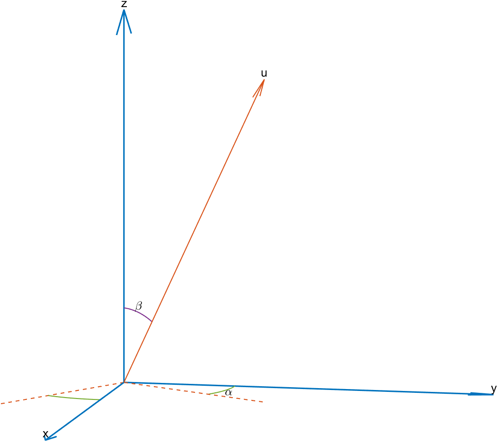

# 三维空间中向量 $\boldsymbol{v}$ 绕向量 $\boldsymbol{u}$ 旋转 $\theta$ 角
* 旋转矩阵

令 $\hat{\boldsymbol{u}}$ 为向量 $\boldsymbol{u}$ 的单位向量，

$$
\boldsymbol{r_1}=
\begin{pmatrix}
\cos\alpha & \sin\alpha & 0\\
-\sin\alpha & \cos\alpha & 0\\
0 & 0 & 1
\end{pmatrix}
$$

$$
\boldsymbol{r_2}=
\begin{pmatrix}
1 & 0 & 0\\
0 & \cos\beta & \sin\beta\\
0 & -\sin\beta & \cos\beta
\end{pmatrix}
$$

$$
\boldsymbol{r_3}=
\begin{pmatrix}
\cos\theta & -\sin\theta & 0\\
\sin\theta & \cos\theta & 0\\
0 & 0 & 1
\end{pmatrix}
$$

$$
\boldsymbol{r_4}=
\begin{pmatrix}
1 & 0 & 0\\
0 & \cos\beta & -\sin\beta\\
0 & \sin\beta & \cos\beta
\end{pmatrix}
$$

$$
\boldsymbol{r_5}=
\begin{pmatrix}
\cos\alpha & -\sin\alpha & 0\\
\sin\alpha & \cos\alpha & 0\\
0 & 0 & 1
\end{pmatrix}
$$

$$\boldsymbol{R}=\boldsymbol{r_1}\boldsymbol{r_2}\boldsymbol{r_3}\boldsymbol{r_4}\boldsymbol{r_5}$$

$$\boldsymbol{v}_{rot}=\boldsymbol{R}\boldsymbol{v}$$

* [罗德里格旋转公式（Rodrigues' rotation formula）](https://www.cnblogs.com/wtyuan/p/12324495.html)

如下

$$
\boldsymbol{v}_{rot}=\boldsymbol{v}cos\theta+\frac{\boldsymbol{u}\times\boldsymbol{v}}{|\boldsymbol{u}|}sin\theta+\frac{(\boldsymbol{v}\cdot\boldsymbol{u})\boldsymbol{u}}{|\boldsymbol{u}|^2}(1-cos\theta)
$$

若归一化旋转向量 $\boldsymbol{u}$ ，单位向量 $\hat{\boldsymbol{u}}=\frac{\boldsymbol{u}}{|\boldsymbol{u}|}$ ，则

$$
\boldsymbol{v}_{rot}=\boldsymbol{v}cos\theta+(\hat{\boldsymbol{u}}\times\boldsymbol{v})sin\theta+\hat{\boldsymbol{u}}(\hat{\boldsymbol{u}}\cdot\boldsymbol{v})(1-cos\theta)
$$

进一步得到矩阵形式

$$
\boldsymbol{v}_{rot}=\boldsymbol{R}\boldsymbol{v}=\boldsymbol{v}+(sin\theta)K\boldsymbol{v}+(1-cos\theta)K^2\boldsymbol{v}\\
$$

其中 $\boldsymbol{R}=I+(sin\theta)K+(1-cos\theta)K^2$ ， $K$ 表示由旋转轴 $\hat{\boldsymbol{u}}(\hat{u}_x,\hat{u}_y,\hat{u}_z)$ 生成的反对称矩阵

$$
K=\begin{pmatrix}
0 & -\hat{u}_z & \hat{u}_y\\
\hat{u}_z & 0 & -\hat{u}_x\\
-\hat{u}_y & \hat{u}_x & 0
\end{pmatrix}
$$

* 四元数
